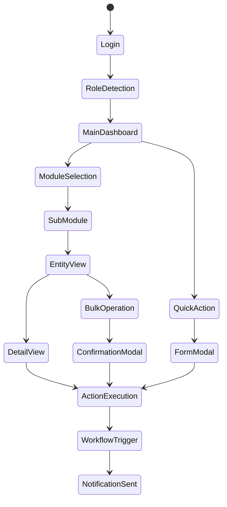
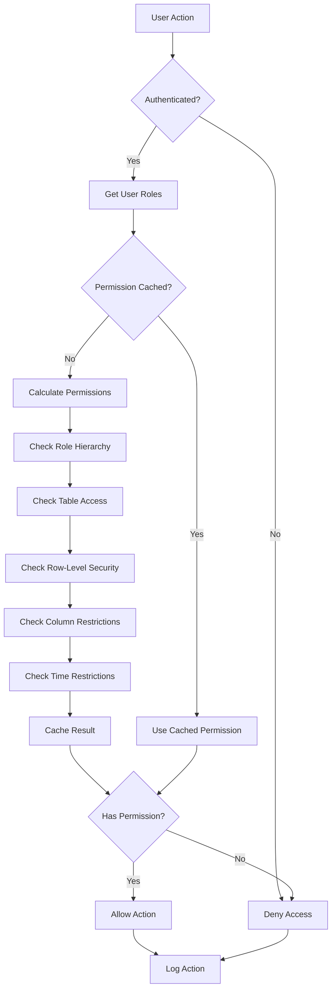
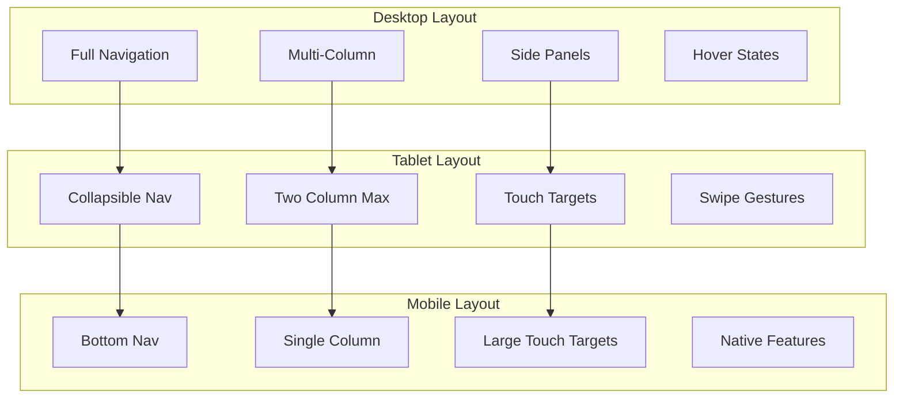
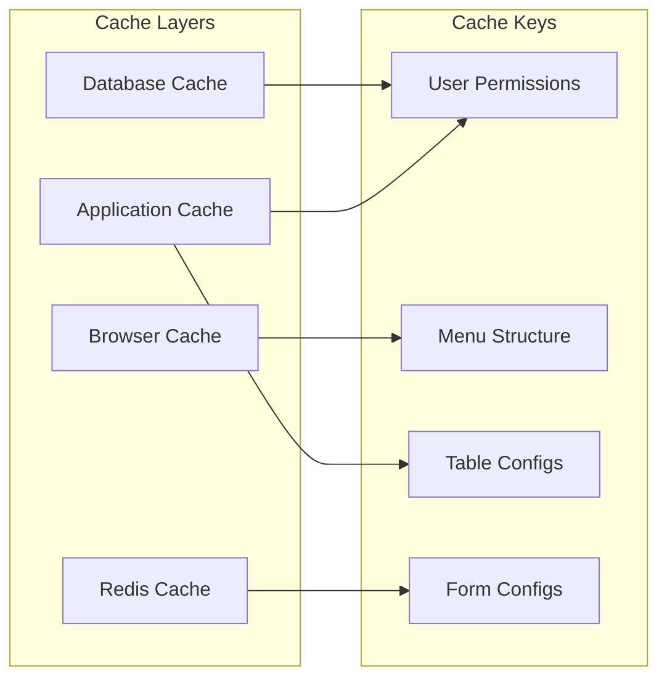

# Enterprise ERP Role-Based UI Organization Plan

## Executive Summary

This document outlines a comprehensive role-based UI organization strategy for an enterprise ERP system featuring dynamic table and form builders. The architecture leverages normalized role structures through `core.roles` and `core.user_roles` tables to provide flexible, scalable, and maintainable access control.

## Table of Contents

1. [System Architecture Overview](#system-architecture-overview)
2. [Role Hierarchy & Structure](#role-hierarchy--structure)
3. [Database Schema Design](#database-schema-design)
4. [UI Organization Strategy](#ui-organization-strategy)
5. [Role-Specific Interfaces](#role-specific-interfaces)
6. [Dynamic Component System](#dynamic-component-system)
7. [Navigation Architecture](#navigation-architecture)
8. [Implementation Guidelines](#implementation-guidelines)
9. [Security & Permissions](#security--permissions)
10. [Mobile & Responsive Design](#mobile--responsive-design)

## System Architecture Overview

```
┌─────────────────────────────────────────────────────────────────┐
│                         FRONTEND LAYER                          │
├─────────────────────────────────────────────────────────────────┤
│  ┌──────────────┐  ┌─────────────┐  ┌──────────────┐          │
│  │ Dynamic UI   │  │ Navigation  │  │  Dashboard   │          │
│  │ Components   │  │   System    │  │   Builder    │          │
│  └──────┬───────┘  └──────┬──────┘  └──────┬───────┘          │
│         │                  │                 │                   │
│  ┌──────▼───────┐  ┌──────▼──────┐         │                   │
│  │    Table     │  │    Form     │         │                   │
│  │   Builder    │  │   Builder   │         │                   │
│  └──────┬───────┘  └──────┬──────┘         │                   │
└─────────┼──────────────────┼────────────────┼───────────────────┘
          │                  │                 │
          ▼                  ▼                 ▼
┌─────────────────────────────────────────────────────────────────┐
│                        MIDDLEWARE LAYER                         │
├─────────────────────────────────────────────────────────────────┤
│  ┌──────────────┐  ┌─────────────┐  ┌──────────────┐          │
│  │Authentication│  │  Role-Based  │  │   Workflow   │          │
│  │              │◄─┤Access Control├─►│    Engine    │          │
│  └──────┬───────┘  └──────┬──────┘  └──────┬───────┘          │
│         │                  │                 │                   │
│         │          ┌───────▼───────┐        │                   │
│         │          │  Permission   │        │                   │
│         │          │     Cache     │        │                   │
│         │          └───────────────┘        │                   │
└─────────┼──────────────────┼────────────────┼───────────────────┘
          │                  │                 │
          ▼                  ▼                 ▼
┌─────────────────────────────────────────────────────────────────┐
│                          DATA LAYER                             │
├─────────────────────────────────────────────────────────────────┤
│  ┌──────────────┐  ┌─────────────┐  ┌──────────────┐          │
│  │  Core Schema │  │Config Schema│  │   Business   │          │
│  │  (users,     │◄─┤  (tables,   ├─►│   Schemas    │          │
│  │   roles)     │  │   forms)    │  │ (sales, inv) │          │
│  └──────────────┘  └─────────────┘  └──────────────┘          │
└─────────────────────────────────────────────────────────────────┘
```

## Role Hierarchy & Structure

### Visual Role Hierarchy

```
┌─────────────────────┐
│   SUPER ADMIN      │ (Full system access)
└──────────┬──────────┘
           │
           ▼
┌─────────────────────┐
│     EXECUTIVE       │ (C-Suite oversight)
└──────────┬──────────┘
           │
           ├──────────────────┬──────────────────┬────────────────┐
           ▼                  ▼                  ▼                │
┌──────────────────┐ ┌──────────────────┐ ┌──────────────────┐ │
│ OPERATIONS DIR.  │ │   SALES DIR.     │ │    HR DIR.       │ │
└──────────────────┘ └──────────────────┘ └──────────────────┘ │
           │                  │                  │                │
           ▼                  ▼                  ▼                │
┌──────────────────┐ ┌──────────────────┐ ┌──────────────────┐ │
│ OPERATIONS MGR   │ │  SALES MANAGER   │ │   HR MANAGER     │ │
└──────────────────┘ └──────────────────┘ └──────────────────┘ │
     │         │              │         │            │           │
     ▼         ▼              ▼         ▼            ▼           │
┌─────────┐ ┌─────────┐ ┌──────────┐ ┌────────┐ ┌────────────┐ │
│WAREHOUSE│ │INVENTORY│ │SALES REP │ │CUSTOMER│ │HR SPECIALIST│ │
│ MANAGER │ │CONTROLLER│└──────────┘ │SERVICE │ └────────────┘ │
└─────────┘ └─────────┘               └────────┘                 │
     │                                                            │
     ▼                                                            │
┌──────────────────┐                                            │
│WAREHOUSE SUPERV. │                                            │
└──────────────────┘                                            │
     │         │                                                 │
     ▼         ▼                                                 │
┌─────────┐ ┌─────────────┐                                    │
│WAREHOUSE│ │QUALITY      │                                    │
│  STAFF  │ │INSPECTOR    │                                    │
└─────────┘ └─────────────┘                                    │

LEGEND:
━━━━━━━━━━━━━━━━━━━━━━━━━━━━━━━━━━━━━━━━━━━━━━━━━━━━━━━━━━
→ Direct reporting/inheritance
• Permissions cascade down the hierarchy
• Child roles inherit parent role permissions
• Override capabilities at each level
━━━━━━━━━━━━━━━━━━━━━━━━━━━━━━━━━━━━━━━━━━━━━━━━━━━━━━━━━━
```

### Role Definitions Table

| Role                     | Key Responsibilities                        | Primary Modules                | Access Level            |
| ------------------------ | ------------------------------------------- | ------------------------------ | ----------------------- |
| **Super Admin**          | System configuration, user management       | All modules                    | Full system access      |
| **Executive**            | Strategic oversight, high-level reporting   | Dashboards, Reports            | Read-only comprehensive |
| **Operations Director**  | Operations strategy, performance monitoring | Inventory, Assets, Workflow    | Approval & oversight    |
| **Sales Director**       | Sales strategy, customer relations          | Sales, CRM, Reports            | Approval & oversight    |
| **HR Director**          | People strategy, compliance                 | HR, Users, Reports             | Full HR access          |
| **Operations Manager**   | Daily operations, workflow management       | Inventory, Procurement, Assets | Create/Edit/Approve     |
| **Warehouse Manager**    | Warehouse operations, staff management      | Inventory, Zones, Transfers    | Full warehouse access   |
| **Sales Manager**        | Team management, pipeline oversight         | Sales, Customers, Orders       | Team data access        |
| **Sales Representative** | Customer interaction, order entry           | Customers, Orders, Products    | Own data + read         |
| **Warehouse Staff**      | Physical operations, inventory handling     | Inventory transactions         | Task-focused access     |

## Database Schema Design

### Core Role Tables

```sql
-- 1. Role Definitions
CREATE TABLE core.roles (
    id UUID PRIMARY KEY DEFAULT gen_random_uuid(),
    name TEXT UNIQUE NOT NULL,
    display_name TEXT NOT NULL,
    description TEXT,
    parent_role_id UUID REFERENCES core.roles(id),
    is_system_role BOOLEAN DEFAULT FALSE,
    is_active BOOLEAN DEFAULT TRUE,
    priority INTEGER DEFAULT 1000, -- For UI ordering
    icon TEXT, -- For visual identification
    color TEXT, -- For UI theming
    created_date TIMESTAMP NOT NULL DEFAULT NOW(),
    updated_date TIMESTAMP NOT NULL DEFAULT NOW()
);

-- 2. User-Role Assignments
CREATE TABLE core.user_roles (
    id UUID PRIMARY KEY DEFAULT gen_random_uuid(),
    user_id UUID NOT NULL REFERENCES core.users(id) ON DELETE CASCADE,
    role_id UUID NOT NULL REFERENCES core.roles(id) ON DELETE CASCADE,
    granted_by UUID REFERENCES core.users(id),
    granted_date TIMESTAMP NOT NULL DEFAULT NOW(),
    expires_date TIMESTAMP,
    is_active BOOLEAN DEFAULT TRUE,
    notes TEXT,
    UNIQUE(user_id, role_id)
);

-- 3. Role-Based Table Access
CREATE TABLE core.role_table_access (
    id UUID PRIMARY KEY DEFAULT gen_random_uuid(),
    role_id UUID NOT NULL REFERENCES core.roles(id) ON DELETE CASCADE,
    table_config_id UUID REFERENCES config.table_configs(id),
    entity_id UUID REFERENCES workflow.entities(id),
    can_view BOOLEAN DEFAULT FALSE,
    can_create BOOLEAN DEFAULT FALSE,
    can_edit BOOLEAN DEFAULT FALSE,
    can_delete BOOLEAN DEFAULT FALSE,
    can_export BOOLEAN DEFAULT FALSE,
    can_approve BOOLEAN DEFAULT FALSE,
    row_level_security JSONB,
    column_restrictions JSONB,
    max_records INTEGER, -- Limit query results
    time_restrictions JSONB, -- Access time windows
    UNIQUE(role_id, COALESCE(table_config_id, entity_id))
);

-- 4. Role Permissions for Features
CREATE TABLE core.role_permissions (
    id UUID PRIMARY KEY DEFAULT gen_random_uuid(),
    role_id UUID NOT NULL REFERENCES core.roles(id) ON DELETE CASCADE,
    permission_key TEXT NOT NULL, -- e.g., 'workflow.create', 'reports.financial'
    permission_value JSONB, -- Flexible permission data
    granted_by UUID REFERENCES core.users(id),
    granted_date TIMESTAMP NOT NULL DEFAULT NOW(),
    UNIQUE(role_id, permission_key)
);
```

### UI Configuration Tables

```sql
-- 1. Role-Based Dashboard Configurations
CREATE TABLE config.role_dashboards (
    id UUID PRIMARY KEY DEFAULT gen_random_uuid(),
    role_id UUID NOT NULL REFERENCES core.roles(id),
    dashboard_name TEXT NOT NULL,
    display_title TEXT NOT NULL,
    is_default BOOLEAN DEFAULT FALSE,
    layout_type TEXT NOT NULL, -- 'grid', 'flex', 'masonry'
    layout_config JSONB NOT NULL,
    refresh_interval INTEGER DEFAULT 300, -- seconds
    is_active BOOLEAN DEFAULT TRUE,
    created_date TIMESTAMP NOT NULL DEFAULT NOW(),
    updated_date TIMESTAMP NOT NULL DEFAULT NOW(),
    UNIQUE(role_id, dashboard_name)
);

-- 2. Role-Based Menu Configurations
CREATE TABLE config.role_menus (
    id UUID PRIMARY KEY DEFAULT gen_random_uuid(),
    role_id UUID NOT NULL REFERENCES core.roles(id),
    menu_type TEXT NOT NULL, -- 'main', 'quick', 'mobile'
    menu_items JSONB NOT NULL,
    quick_actions JSONB,
    is_active BOOLEAN DEFAULT TRUE,
    created_date TIMESTAMP NOT NULL DEFAULT NOW(),
    updated_date TIMESTAMP NOT NULL DEFAULT NOW(),
    UNIQUE(role_id, menu_type)
);

-- 3. Role-Specific Page Layouts
CREATE TABLE config.role_page_layouts (
    id UUID PRIMARY KEY DEFAULT gen_random_uuid(),
    role_id UUID NOT NULL REFERENCES core.roles(id),
    page_name TEXT NOT NULL,
    layout_type TEXT NOT NULL,
    components JSONB NOT NULL,
    mobile_components JSONB,
    permissions JSONB,
    created_date TIMESTAMP NOT NULL DEFAULT NOW(),
    updated_date TIMESTAMP NOT NULL DEFAULT NOW(),
    UNIQUE(role_id, page_name)
);
```

## UI Organization Strategy

### Three-Tier Navigation System

```
┌───────────────────────────────────────────────────────────────────┐
│                      PRIMARY NAVIGATION                           │
├───────────────────────────────────────────────────────────────────┤
│  [≡] Modules        [⚡] Quick Actions       [👤] User Menu      │
│   │                  │                        │                   │
│   ├─ Inventory      ├─ New Order            ├─ Profile          │
│   ├─ Sales          ├─ Add Customer         ├─ Settings         │
│   ├─ Procurement    ├─ Quick Inventory      ├─ Notifications    │
│   ├─ Assets         └─ Create Task          └─ Logout           │
│   └─ Reports                                                     │
└───────────────────────────────────────────────────────────────────┘
                            ▼
┌───────────────────────────────────────────────────────────────────┐
│                     SECONDARY NAVIGATION                          │
├───────────────────────────────────────────────────────────────────┤
│  Current Module: Inventory                                        │
│  ┌─────────────┬──────────────┬──────────────┬────────────────┐ │
│  │ Sub-Modules │ Saved Views  │ Recent Items │ Favorites      │ │
│  ├─────────────┼──────────────┼──────────────┼────────────────┤ │
│  │ • Dashboard │ • Low Stock  │ • Item #1234 │ ⭐ Warehouse A │ │
│  │ • Items     │ • Overstock  │ • Transfer 5 │ ⭐ Cycle Count │ │
│  │ • Locations │ • My Items   │ • Adjust #99 │ ⭐ Receiving   │ │
│  │ • Transfers │ • Pending    │ • Item #5678 │                │ │
│  └─────────────┴──────────────┴──────────────┴────────────────┘ │
└───────────────────────────────────────────────────────────────────┘
                            ▼
┌───────────────────────────────────────────────────────────────────┐
│                    CONTEXTUAL NAVIGATION                          │
├───────────────────────────────────────────────────────────────────┤
│  📍 Home > Inventory > Items > Widget-X1000                       │
│  ┌────────────────────────────────────────────────────────────┐  │
│  │ Actions:  [Edit] [Duplicate] [Transfer] [Adjust] [History] │  │
│  └────────────────────────────────────────────────────────────┘  │
│  Related: • Purchase Orders (5) • Sales Orders (23) • Suppliers  │
└───────────────────────────────────────────────────────────────────┘
```

### Component Architecture

```
┌─────────────────────────────────────────────────────────────────────────┐
│                            PAGE CONTAINER                               │
├─────────────────────────────────────────────────────────────────────────┤
│                                                                         │
│  ┌───────────────────────── HEADER ZONE ─────────────────────────────┐ │
│  │  [🔍 Global Search...................]  [🔔 5] [📧 3] [👤 Admin ▼]│ │
│  └────────────────────────────────────────────────────────────────────┘ │
│                                                                         │
│  ┌─── NAVIGATION ───┐  ┌────────────── CONTENT ZONE ────────────────┐ │
│  │                  │  │                                             │ │
│  │ ▼ Dashboard      │  │  ┌──────────── ACTION BAR ──────────────┐  │ │
│  │ ▼ Sales          │  │  │ Filters [▼] | Bulk Actions | + Create │  │ │
│  │   • Orders       │  │  └───────────────────────────────────────┘  │ │
│  │   • Customers    │  │                                             │ │
│  │ ▼ Inventory      │  │  ┌────────── MAIN CONTENT ──────────────┐  │ │
│  │   • Items        │  │  │                                       │  │ │
│  │   • Warehouses   │  │  │   ┌─── Dynamic Table/Form ────┐     │  │ │
│  │   • Transfers    │  │  │   │                            │     │  │ │
│  │ ▼ Procurement    │  │  │   │  [Component based on       │     │  │ │
│  │ ▼ Assets         │  │  │   │   role & context]          │     │  │ │
│  │ ▼ Reports        │  │  │   │                            │     │  │ │
│  │ ▼ Settings       │  │  │   │  • Table View              │     │  │ │
│  │                  │  │  │   │  • Form Builder            │     │  │ │
│  │ ─────────────    │  │  │   │  • Dashboard Widgets       │     │  │ │
│  │                  │  │  │   │  • Kanban Board            │     │  │ │
│  │ 📌 Quick Access  │  │  │   │                            │     │  │ │
│  │ • Pending (12)   │  │  │   └────────────────────────────┘     │  │ │
│  │ • My Tasks       │  │  │                                       │  │ │
│  │ • Favorites      │  │  └───────────────────────────────────────┘  │ │
│  │                  │  │                                             │ │
│  └──────────────────┘  │  ┌──────────── SIDE PANEL ──────────────┐  │ │
│                        │  │  Quick Details                       │  │ │
│                        │  │  ┌──────────────────────────────┐    │  │ │
│                        │  │  │ Item: WIDG-001               │    │  │ │
│                        │  │  │ Status: Active               │    │  │ │
│                        │  │  │ Stock: 245 units             │    │  │ │
│                        │  │  └──────────────────────────────┘    │  │ │
│                        │  │                                       │  │ │
│                        │  │  Related Items                       │  │ │
│                        │  │  • PO-2024-001                      │  │ │
│                        │  │  • SO-2024-445                      │  │ │
│                        │  │  • Transfer-089                      │  │ │
│                        │  └───────────────────────────────────────┘  │ │
│                        └──────────────────────────────────────────────┘ │
│                                                                         │
└─────────────────────────────────────────────────────────────────────────┘
```

## Role-Specific Interfaces

### Executive Dashboard Configuration

```javascript
{
  "role": "executive",
  "dashboard_config": {
    "layout": "executive_overview",
    "grid": {
      "columns": 12,
      "rows": "auto",
      "gap": "16px"
    },
    "widgets": [
      {
        "id": "kpi_overview",
        "type": "kpi_cards",
        "position": { "col": 1, "row": 1, "colspan": 12 },
        "config": {
          "metrics": [
            {
              "label": "Revenue MTD",
              "source": "sales.orders",
              "calculation": "sum(total)",
              "comparison": "previous_month"
            },
            {
              "label": "Active Orders",
              "source": "sales.orders",
              "filter": "status != 'completed'",
              "real_time": true
            },
            {
              "label": "Inventory Value",
              "source": "inventory.items",
              "calculation": "sum(quantity * unit_cost)"
            },
            {
              "label": "Employee Count",
              "source": "core.users",
              "filter": "enabled = true"
            }
          ]
        }
      },
      {
        "id": "performance_trends",
        "type": "line_chart",
        "position": { "col": 1, "row": 2, "colspan": 8 },
        "config": {
          "title": "Operations Performance Trends",
          "data_sources": [
            {
              "name": "Order Fulfillment",
              "query": "fulfillment_rate_by_day"
            },
            {
              "name": "Quality Score",
              "query": "quality_metrics_daily"
            }
          ],
          "period": "last_30_days",
          "refresh_interval": 300
        }
      },
      {
        "id": "alerts_summary",
        "type": "alert_list",
        "position": { "col": 9, "row": 2, "colspan": 4 },
        "config": {
          "title": "Critical Alerts",
          "categories": ["financial", "operational", "compliance"],
          "priority": ["high", "critical"],
          "limit": 10
        }
      }
    ]
  }
}
```

### Operations Manager Workspace

```javascript
{
  "role": "operations_manager",
  "workspace_config": {
    "primary_view": "operational_dashboard",
    "quick_access_modules": [
      "inventory.dashboard",
      "procurement.orders",
      "assets.management",
      "workflow.automation"
    ],
    "dashboard_widgets": [
      {
        "type": "inventory_alerts",
        "config": {
          "show_low_stock": true,
          "show_expiring": true,
          "show_pending_transfers": true
        }
      },
      {
        "type": "kanban_board",
        "config": {
          "entity": "inventory.transfer_orders",
          "group_by": "status",
          "columns": ["pending", "in_transit", "received", "cancelled"]
        }
      },
      {
        "type": "table_view",
        "config": {
          "table_config_id": "pending_approvals",
          "auto_refresh": 60,
          "enable_quick_approve": true
        }
      }
    ],
    "mobile_features": {
      "enable_barcode_scanning": true,
      "offline_mode": true,
      "quick_actions": [
        "inventory_adjustment",
        "transfer_order",
        "quality_inspection"
      ]
    }
  }
}
```

### Sales Representative Interface

```javascript
{
  "role": "sales_rep",
  "interface_config": {
    "landing_page": "my_dashboard",
    "data_filtering": {
      "customers": "assigned_to = current_user",
      "orders": "created_by = current_user OR assigned_to = current_user",
      "products": "is_active = true" // Read-only access
    },
    "dashboard_layout": {
      "type": "sales_focused",
      "sections": [
        {
          "title": "My Pipeline",
          "type": "pipeline_view",
          "config": {
            "stages": ["lead", "qualified", "proposal", "negotiation", "closed"],
            "show_value": true,
            "enable_drag_drop": true
          }
        },
        {
          "title": "Today's Activities",
          "type": "activity_list",
          "config": {
            "types": ["calls", "meetings", "follow_ups"],
            "show_overdue": true
          }
        },
        {
          "title": "Quick Entry",
          "type": "form_widget",
          "config": {
            "forms": ["quick_order", "new_customer", "activity_log"]
          }
        }
      ]
    },
    "mobile_optimized": true,
    "offline_capabilities": ["view_customers", "view_products", "draft_orders"]
  }
}
```

### Warehouse Staff Mobile Interface

```javascript
{
  "role": "warehouse_staff",
  "mobile_interface": {
    "device_type": "handheld_scanner",
    "home_screen": {
      "layout": "task_focused",
      "components": [
        {
          "type": "large_button",
          "label": "Scan Item",
          "action": "barcode_scanner",
          "icon": "qr_code",
          "color": "primary"
        },
        {
          "type": "task_counter",
          "label": "Pending Picks",
          "source": "my_pick_list",
          "tap_action": "open_pick_list"
        },
        {
          "type": "task_counter",
          "label": "Put-aways",
          "source": "pending_putaways",
          "tap_action": "open_putaway_list"
        },
        {
          "type": "quick_action_grid",
          "actions": [
            "cycle_count",
            "report_damage",
            "request_help",
            "view_location"
          ]
        }
      ]
    },
    "scanning_workflows": {
      "pick_items": {
        "steps": ["scan_location", "scan_item", "confirm_quantity", "next_pick"],
        "validations": ["location_match", "item_match", "quantity_available"]
      },
      "receive_items": {
        "steps": ["scan_po", "scan_item", "enter_quantity", "quality_check", "assign_location"],
        "validations": ["po_valid", "item_on_po", "location_available"]
      }
    },
    "offline_mode": {
      "enabled": true,
      "sync_interval": 300,
      "cached_data": ["locations", "items", "my_tasks"]
    }
  }
}
```

## Dynamic Component System

### Component Permission Matrix

```
┌──────────────────────────────────────────────────────────────────┐
│                     COMPONENT TYPES                              │
├──────────────────────────────────────────────────────────────────┤
│                                                                  │
│  ┌───────────────┐  ┌───────────────┐  ┌───────────────┐      │
│  │    TABLE      │  │     FORM      │  │   DASHBOARD   │      │
│  │   COMPONENT   │  │   COMPONENT   │  │   COMPONENT   │      │
│  └───────┬───────┘  └───────┬───────┘  └───────┬───────┘      │
│          │                   │                   │               │
│          ▼                   ▼                   ▼               │
│  ┌───────────────────────────────────────────────────────┐      │
│  │              PERMISSION CHECKS                        │      │
│  ├───────────────────────────────────────────────────────┤      │
│  │                                                       │      │
│  │  [✓] Can View    ──┐                                │      │
│  │  [✓] Can Create  ──┤                                │      │
│  │  [✓] Can Edit    ──┼──► Applied to Components      │      │
│  │  [✓] Can Delete  ──┤                                │      │
│  │  [✓] Can Export  ──┘                                │      │
│  │                                                       │      │
│  └───────────────────────────────────────────────────────┘      │
│                              │                                   │
│                              ▼                                   │
│  ┌───────────────────────────────────────────────────────┐      │
│  │                 ACCESS LEVELS                         │      │
│  ├───────────────────────────────────────────────────────┤      │
│  │                                                       │      │
│  │  ROLE-BASED ────► "User has sales_manager role"     │      │
│  │      ↓                                               │      │
│  │  ROW-LEVEL  ────► "Only records where owner = user" │      │
│  │      ↓                                               │      │
│  │  COLUMN-LEVEL ──► "Hide: cost, margin columns"      │      │
│  │      ↓                                               │      │
│  │  TIME-BASED ────► "Access only during 9am-5pm"      │      │
│  │                                                       │      │
│  └───────────────────────────────────────────────────────┘      │
└──────────────────────────────────────────────────────────────────┘

PERMISSION INHERITANCE FLOW:
═══════════════════════════════════════════════════════════════════
Role Permission → Component Permission → Row Security → Column Security
                     ↓                      ↓              ↓
                [Table View]         [Filter: team=x]  [Hide: salary]
═══════════════════════════════════════════════════════════════════
```

### Dynamic Table Configuration

```javascript
{
  "table_config": {
    "id": "order_management_table",
    "entity": "sales.orders",
    "base_view": "sales.orders_base",
    "role_configurations": {
      "sales_rep": {
        "visible_columns": [
          "order_number", "customer_name", "order_date",
          "total_amount", "status", "assigned_to"
        ],
        "editable_columns": ["notes", "priority"],
        "filters": {
          "default": "assigned_to = current_user",
          "available": ["date_range", "status", "customer"]
        },
        "row_actions": ["view", "edit", "clone"],
        "bulk_actions": ["export"],
        "row_level_security": "assigned_to = current_user OR created_by = current_user"
      },
      "sales_manager": {
        "visible_columns": "*", // All columns
        "editable_columns": ["*", "-financial_fields"],
        "filters": {
          "default": "team = current_user_team",
          "available": "*"
        },
        "row_actions": ["view", "edit", "approve", "reassign", "delete"],
        "bulk_actions": ["export", "bulk_reassign", "bulk_approve"],
        "row_level_security": "team_id IN (SELECT team_id FROM user_teams WHERE user_id = current_user)"
      },
      "operations_manager": {
        "visible_columns": [
          "order_number", "customer_name", "order_date",
          "fulfillment_status", "warehouse", "priority"
        ],
        "editable_columns": ["fulfillment_status", "warehouse", "priority"],
        "filters": {
          "default": "fulfillment_status != 'completed'",
          "available": ["warehouse", "fulfillment_status", "date_range"]
        },
        "row_actions": ["view", "edit_fulfillment", "print_pick_list"],
        "bulk_actions": ["assign_warehouse", "generate_pick_lists"]
      }
    }
  }
}
```

### Dynamic Form Configuration

```javascript
{
  "form_config": {
    "id": "customer_order_form",
    "entity": "sales.orders",
    "role_configurations": {
      "sales_rep": {
        "sections": [
          {
            "title": "Customer Information",
            "fields": [
              {
                "name": "customer_id",
                "type": "lookup",
                "required": true,
                "filter": "assigned_to = current_user"
              },
              {
                "name": "contact_person",
                "type": "text",
                "auto_populate": "from_customer"
              }
            ]
          },
          {
            "title": "Order Details",
            "fields": [
              {
                "name": "order_date",
                "type": "date",
                "default": "today",
                "editable": false
              },
              {
                "name": "delivery_date",
                "type": "date",
                "required": true,
                "validation": "must_be_future"
              }
            ]
          },
          {
            "title": "Line Items",
            "type": "repeater",
            "fields": [
              {
                "name": "product_id",
                "type": "lookup",
                "source": "products.products",
                "filter": "is_active = true"
              },
              {
                "name": "quantity",
                "type": "number",
                "validation": "check_inventory"
              },
              {
                "name": "discount",
                "type": "percentage",
                "max_value": "10", // 10% max for sales reps
                "requires_approval": "discount > 5"
              }
            ]
          }
        ],
        "actions": [
          {
            "type": "save_draft",
            "label": "Save Draft"
          },
          {
            "type": "submit",
            "label": "Submit Order",
            "confirmation": "Submit this order for processing?"
          }
        ]
      },
      "sales_manager": {
        "extends": "sales_rep",
        "additional_fields": [
          {
            "section": "Order Details",
            "fields": [
              {
                "name": "credit_terms",
                "type": "select",
                "options": ["net30", "net60", "net90"]
              },
              {
                "name": "special_pricing",
                "type": "checkbox"
              }
            ]
          }
        ],
        "override_validations": {
          "discount": {
            "max_value": "25",
            "requires_approval": "discount > 20"
          }
        }
      }
    }
  }
}
```

## Navigation Architecture

### Multi-Level Navigation Structure



### Menu Generation Logic

```javascript
class MenuGenerator {
  constructor(userId) {
    this.userId = userId;
    this.userRoles = this.loadUserRoles();
    this.permissions = this.loadPermissions();
  }

  async generateMenu() {
    const menu = {
      primary: [],
      secondary: [],
      quick: [],
      user: [],
    };

    // Build primary navigation
    for (const role of this.userRoles) {
      const roleMenus = await this.getRoleMenuItems(role.id);

      for (const item of roleMenus) {
        if (this.hasPermission(item.required_permission)) {
          menu.primary.push({
            id: item.id,
            label: item.label,
            icon: item.icon,
            path: item.path,
            badge: await this.getBadgeCount(item.badge_query),
            children: await this.getSubMenuItems(item.id, role.id),
          });
        }
      }
    }

    // Build quick actions
    const quickActions = await this.getQuickActionsForRoles(this.userRoles);
    menu.quick = quickActions.filter((action) =>
      this.hasPermission(action.required_permission)
    );

    // Build user menu
    menu.user = [
      { label: "Profile", path: "/profile", icon: "user" },
      { label: "Settings", path: "/settings", icon: "settings" },
      { label: "Help", path: "/help", icon: "help" },
      { type: "divider" },
      { label: "Logout", action: "logout", icon: "logout" },
    ];

    return this.sortAndOrganize(menu);
  }

  hasPermission(permission) {
    if (!permission) return true;

    // Check role hierarchy
    for (const role of this.userRoles) {
      if (this.checkRolePermission(role, permission)) {
        return true;
      }
    }
    return false;
  }

  async getBadgeCount(query) {
    if (!query) return null;

    // Execute query with user context
    const result = await this.executeQuery(query, {
      user_id: this.userId,
      role_ids: this.userRoles.map((r) => r.id),
    });

    return result.count > 0 ? result.count : null;
  }
}
```

## Implementation Guidelines

### Phase 1: Foundation (Weeks 1-4)

1. **Database Setup**

   - Create role and permission tables
   - Establish role hierarchies
   - Set up initial roles and permissions

2. **Authentication & Authorization**

   - Implement role-based authentication
   - Create permission checking middleware
   - Build permission caching system

3. **Basic UI Framework**
   - Implement dynamic menu generation
   - Create role-aware routing
   - Build base layout components

### Phase 2: Core Components (Weeks 5-8)

1. **Dynamic Table Builder**

   - Implement role-based column visibility
   - Add row-level security
   - Create filter and sort configurations

2. **Dynamic Form Builder**

   - Build role-aware field rendering
   - Implement conditional validations
   - Add approval workflow integration

3. **Dashboard System**
   - Create widget framework
   - Implement role-specific dashboards
   - Add real-time data updates

### Phase 3: Advanced Features (Weeks 9-12)

1. **Workflow Integration**

   - Connect forms to workflow engine
   - Implement approval chains
   - Add notification system

2. **Mobile Optimization**

   - Create responsive layouts
   - Build offline capabilities
   - Implement scanning features

3. **Reporting & Analytics**
   - Build report builder
   - Add export capabilities
   - Create scheduled reports

### Phase 4: Polish & Optimization (Weeks 13-16)

1. **Performance Optimization**

   - Implement query optimization
   - Add caching strategies
   - Optimize permission checks

2. **User Experience**

   - Conduct usability testing
   - Refine workflows
   - Add help system

3. **Security Hardening**
   - Security audit
   - Penetration testing
   - Implement audit logging

## Security & Permissions

### Permission Checking Flow



### Row-Level Security Examples

```sql
-- Sales Rep: Can only see their own customers
CREATE POLICY sales_rep_customer_policy ON sales.customers
    FOR ALL
    TO sales_rep_role
    USING (assigned_to = current_user_id());

-- Manager: Can see their team's data
CREATE POLICY manager_team_policy ON sales.orders
    FOR ALL
    TO sales_manager_role
    USING (
        created_by IN (
            SELECT user_id
            FROM core.user_teams
            WHERE team_id IN (
                SELECT team_id
                FROM core.user_teams
                WHERE user_id = current_user_id()
                AND is_manager = true
            )
        )
    );

-- Time-based access for warehouse staff
CREATE POLICY warehouse_shift_policy ON inventory.transactions
    FOR ALL
    TO warehouse_staff_role
    USING (
        EXTRACT(HOUR FROM CURRENT_TIME) BETWEEN 6 AND 22
        OR EXISTS (
            SELECT 1 FROM hr.shift_overrides
            WHERE user_id = current_user_id()
            AND override_date = CURRENT_DATE
        )
    );
```

### Audit Trail Implementation

```sql
CREATE TABLE core.audit_log (
    id UUID PRIMARY KEY DEFAULT gen_random_uuid(),
    user_id UUID REFERENCES core.users(id),
    role_id UUID REFERENCES core.roles(id),
    action TEXT NOT NULL,
    entity_type TEXT NOT NULL,
    entity_id UUID,
    old_values JSONB,
    new_values JSONB,
    ip_address INET,
    user_agent TEXT,
    success BOOLEAN NOT NULL,
    error_message TEXT,
    created_at TIMESTAMP NOT NULL DEFAULT NOW()
);

-- Create audit trigger function
CREATE OR REPLACE FUNCTION audit_trigger_function()
RETURNS TRIGGER AS $$
BEGIN
    INSERT INTO core.audit_log (
        user_id,
        role_id,
        action,
        entity_type,
        entity_id,
        old_values,
        new_values,
        success
    ) VALUES (
        current_user_id(),
        current_role_id(),
        TG_OP,
        TG_TABLE_SCHEMA || '.' || TG_TABLE_NAME,
        COALESCE(NEW.id, OLD.id),
        CASE WHEN TG_OP IN ('UPDATE', 'DELETE') THEN row_to_json(OLD) END,
        CASE WHEN TG_OP IN ('INSERT', 'UPDATE') THEN row_to_json(NEW) END,
        true
    );
    RETURN NEW;
END;
$$ LANGUAGE plpgsql;
```

## Mobile & Responsive Design

### Responsive Breakpoints

```css
/* Mobile First Approach */
:root {
  --breakpoint-xs: 320px; /* Mobile phones */
  --breakpoint-sm: 640px; /* Large phones */
  --breakpoint-md: 768px; /* Tablets */
  --breakpoint-lg: 1024px; /* Desktop */
  --breakpoint-xl: 1280px; /* Large desktop */
  --breakpoint-2xl: 1536px; /* Extra large */
}
```

### Device-Specific Layouts



### Mobile-Specific Features

```javascript
{
  "mobile_features": {
    "warehouse_staff": {
      "native_capabilities": [
        "camera_barcode_scanning",
        "nfc_tag_reading",
        "voice_commands",
        "haptic_feedback"
      ],
      "offline_mode": {
        "sync_strategy": "background_sync",
        "cache_size_mb": 100,
        "data_priority": [
          "active_tasks",
          "inventory_locations",
          "product_catalog"
        ]
      },
      "gestures": {
        "swipe_right": "complete_task",
        "swipe_left": "skip_task",
        "long_press": "quick_info",
        "pinch": "zoom_layout"
      }
    },
    "sales_rep": {
      "native_capabilities": [
        "contact_integration",
        "calendar_sync",
        "location_services",
        "document_scanner"
      ],
      "quick_actions": {
        "floating_button": true,
        "actions": [
          "new_order",
          "add_customer",
          "check_inventory"
        ]
      }
    }
  }
}
```

## Performance Optimization

### Caching Strategy



### Query Optimization

```sql
-- Create materialized view for dashboard metrics
CREATE MATERIALIZED VIEW dashboard.executive_metrics AS
SELECT
    DATE_TRUNC('day', o.created_date) as date,
    COUNT(DISTINCT o.id) as order_count,
    SUM(oli.quantity * oli.unit_price) as revenue,
    AVG(EXTRACT(EPOCH FROM (o.fulfilled_date - o.created_date))/3600) as avg_fulfillment_hours,
    COUNT(DISTINCT o.customer_id) as unique_customers
FROM sales.orders o
JOIN sales.order_line_items oli ON o.id = oli.order_id
WHERE o.created_date >= CURRENT_DATE - INTERVAL '90 days'
GROUP BY DATE_TRUNC('day', o.created_date);

-- Refresh strategy
CREATE OR REPLACE FUNCTION refresh_executive_metrics()
RETURNS void AS $$
BEGIN
    REFRESH MATERIALIZED VIEW CONCURRENTLY dashboard.executive_metrics;
END;
$$ LANGUAGE plpgsql;

-- Schedule refresh
SELECT cron.schedule('refresh-executive-metrics', '*/15 * * * *',
    'SELECT refresh_executive_metrics()');
```

## Testing Strategy

### Test Coverage Areas

1. **Unit Tests**

   - Permission checking functions
   - Menu generation logic
   - Data filtering rules

2. **Integration Tests**

   - Role-based access flows
   - Cross-module workflows
   - API endpoint security

3. **E2E Tests**

   - Complete user journeys
   - Role switching scenarios
   - Mobile device workflows

4. **Performance Tests**
   - Load testing with multiple roles
   - Permission calculation speed
   - Dashboard rendering time

## Maintenance & Monitoring

### Key Metrics to Monitor

```javascript
{
  "monitoring_metrics": {
    "performance": [
      "page_load_time",
      "api_response_time",
      "permission_check_duration",
      "cache_hit_ratio"
    ],
    "usage": [
      "active_users_by_role",
      "feature_usage_by_module",
      "mobile_vs_desktop_ratio",
      "peak_usage_times"
    ],
    "errors": [
      "permission_denied_count",
      "failed_workflows",
      "form_validation_errors",
      "sync_failures"
    ],
    "security": [
      "failed_login_attempts",
      "suspicious_access_patterns",
      "privilege_escalation_attempts",
      "data_export_volume"
    ]
  }
}
```

### Maintenance Schedule

| Task                     | Frequency | Responsible Role |
| ------------------------ | --------- | ---------------- |
| Permission audit         | Monthly   | Security Admin   |
| Role review              | Quarterly | System Admin     |
| Performance optimization | Monthly   | DevOps           |
| User feedback review     | Bi-weekly | Product Owner    |
| Security patches         | As needed | Security Team    |
| Database maintenance     | Weekly    | DBA              |

## Conclusion

This role-based UI organization provides:

1. **Flexibility** - Easy to add new roles and modify permissions
2. **Scalability** - Handles complex permission scenarios efficiently
3. **Security** - Multiple layers of access control
4. **Usability** - Tailored interfaces for each role
5. **Maintainability** - Clear structure and separation of concerns

The system leverages your existing dynamic table and form builders while providing a robust framework for role-based access control. The architecture supports both current needs and future growth, with clear paths for enhancement and optimization.

## Appendix: Configuration Examples

### Sample Role Configuration

```yaml
role: warehouse_supervisor
display_name: Warehouse Supervisor
parent: warehouse_manager
permissions:
  modules:
    - inventory: full
    - assets: view
    - users: view_team
  special:
    - approve_adjustments
    - assign_tasks
    - modify_zones
  restrictions:
    - max_adjustment_value: 10000
    - time_window: "06:00-22:00"
  delegatable:
    - view_inventory
    - create_counts
```

### Sample Widget Configuration

```json
{
  "widget": {
    "id": "inventory_heatmap",
    "type": "heatmap",
    "title": "Warehouse Utilization",
    "data_source": {
      "query": "SELECT zone, utilization_percent FROM warehouse_metrics",
      "refresh_interval": 300
    },
    "visualization": {
      "color_scale": ["#00ff00", "#ffff00", "#ff0000"],
      "thresholds": [70, 85, 95],
      "interactive": true
    },
    "actions": {
      "click": "drill_down_to_zone",
      "hover": "show_details"
    }
  }
}
```

---

_Document Version: 1.0_  
_Last Updated: [Current Date]_  
_Status: Draft for Review_
