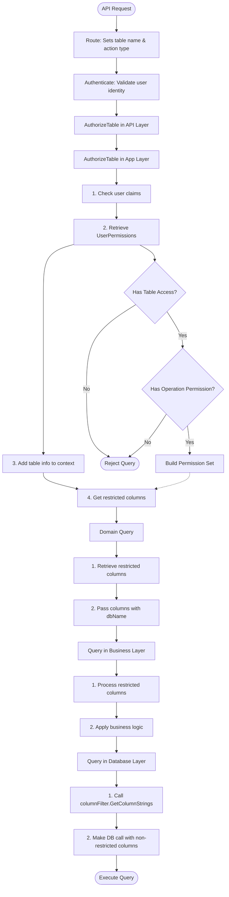

```mermaid
flowchart TD
    Start([API Request]) --> Route[Route: Sets table name & action type]
    Route --> Auth[Authenticate: Validate user identity]
    Auth --> AuthTable1[AuthorizeTable in API Layer]
    
    AuthTable1 --> AuthTable2[AuthorizeTable in App Layer]
    
    AuthTable2 --> CheckClaims[1. Check user claims]
    CheckClaims --> LoadPermissions[2. Retrieve UserPermissions]
    LoadPermissions --> AddContext[3. Add table info to context]
    AddContext --> GetRestricted[4. Get restricted columns]
    
    GetRestricted --> DomainAssets[Domain Query]
    
    DomainAssets --> RetrieveColumns[1. Retrieve restricted columns]
    RetrieveColumns --> PassColumns[2. Pass columns with dbName]
    
    PassColumns --> BusinessQuery1[Query in Business Layer]
    
    BusinessQuery1 --> ProcessColumns[1. Process restricted columns]
    ProcessColumns --> ApplyLogic[2. Apply business logic]
    
    ApplyLogic --> BusinessQuery2[Query in Database Layer]
    
    BusinessQuery2 --> FilterColumns[1. Call columnFilter.GetColumnStrings]
    FilterColumns --> MakeQuery[2. Make DB call with non-restricted columns]
    
    MakeQuery --> ExecuteQuery([Execute Query])
    
    LoadPermissions --> CheckTableAccess{Has Table Access?}
    CheckTableAccess -->|No| Reject([Reject Query])
    CheckTableAccess -->|Yes| CheckOperation{Has Operation Permission?}
    CheckOperation -->|No| Reject
    CheckOperation -->|Yes| BuildPermSet[Build Permission Set]
    
    BuildPermSet -.-> GetRestricted
```