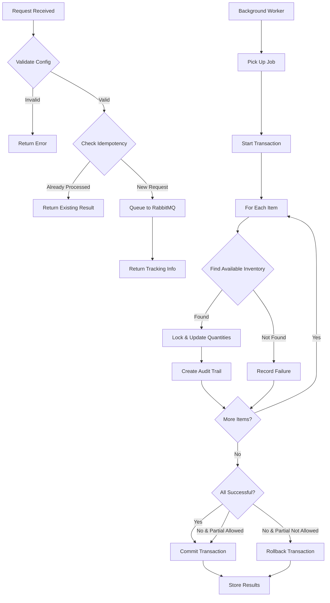

# Inventory Allocation System - Developer Guide

## Overview

This is a sophisticated **inventory allocation handler** that manages how products get reserved or allocated from warehouse inventory. Think of it like a traffic controller for inventory - when an order comes in, this system figures out which warehouse locations have the stock and claims it.

## Core Concepts

### Allocation Modes

The system supports two primary modes of inventory allocation:

| Mode         | Description                   | Use Case                              |
| ------------ | ----------------------------- | ------------------------------------- |
| **Reserve**  | Temporarily holds inventory   | Like putting items in a shopping cart |
| **Allocate** | Permanently commits inventory | Final order commitment                |

### Allocation Strategies

Different strategies for choosing which inventory to use:

| Strategy         | Description                                      | Implementation Status     |
| ---------------- | ------------------------------------------------ | ------------------------- |
| `fifo`           | First In, First Out - Use oldest inventory first | ✅ Implemented            |
| `lifo`           | Last In, First Out - Use newest inventory first  | ✅ Implemented            |
| `nearest_expiry` | For perishables, use items expiring soonest      | ⚠️ Simplified (uses FIFO) |
| `lowest_cost`    | Choose cheapest warehouse location               | ⚠️ Simplified (uses FIFO) |

#### Planned Future Strategies (from TODO)

- `nearest_location` - Minimize shipping distance
- `load_balancing` - Distribute across warehouses
- `priority_zone` - VIP customers get premium stock

## Architecture

### Asynchronous Processing Pattern

The system uses a two-phase approach to handle requests efficiently:

```
┌─────────────┐     ┌──────────────┐     ┌─────────────────┐
│   Client    │────▶│   Execute()  │────▶│    RabbitMQ     │
└─────────────┘     └──────────────┘     └─────────────────┘
                            │                      │
                    Returns Tracking ID      Queued for Processing
                            ▼                      ▼
                    ┌──────────────┐     ┌─────────────────┐
                    │   Response   │     │ProcessAllocation│
                    └──────────────┘     └─────────────────┘
```

**Phase 1: Execute()**

- Validates configuration
- Checks idempotency
- Queues request to RabbitMQ
- Returns immediately with tracking ID

**Phase 2: ProcessAllocation()**

- Background worker processes asynchronously
- Performs actual inventory allocation
- Updates database with results

### Idempotency Protection

- **Key Format**: `{ExecutionID}_{RuleID}_{ActionType}`
- Prevents duplicate processing if same request sent multiple times
- Critical for preventing double-allocation scenarios
- Results stored in `allocation_results` table

### Database Transaction Management

- Uses `sql.LevelReadCommitted` isolation level
- Balances consistency with performance
- Row-level locking with `FOR UPDATE` clause
- All-or-nothing commits based on configuration

## Data Flow



## Business Logic

### Inventory Availability Calculation

```go
Available = Total Quantity - Reserved Quantity - Allocated Quantity
```

This three-part tracking enables:

- Real-time availability checks
- Temporary holds (reservations)
- Permanent commitments (allocations)

### Configuration Options

| Field                 | Type    | Description                                          |
| --------------------- | ------- | ---------------------------------------------------- |
| `inventory_items`     | Array   | List of products and quantities to allocate          |
| `allocation_mode`     | String  | Either 'reserve' or 'allocate'                       |
| `allocation_strategy` | String  | FIFO, LIFO, etc.                                     |
| `allow_partial`       | Boolean | Accept partial fulfillment or require all-or-nothing |
| `reservation_hours`   | Integer | How long reservations last (default: 24)             |
| `priority`            | String  | low/medium/high/critical                             |
| `timeout_ms`          | Integer | Processing timeout                                   |
| `reference_id`        | String  | Link to order/transfer                               |
| `reference_type`      | String  | Type of reference (order, transfer, etc.)            |

### Priority System

Requests are prioritized in the queue:

- `critical`: Priority 20
- `high`: Priority 10
- `medium`: Priority 5
- `low`: Priority 1

## Key Components & Dependencies

### Internal Business Services

- **inventoryitembus**: Manages individual inventory records
- **productbus**: Product information management
- **locationBus**: Warehouse/location management
- **transactionBus**: Creates audit trail of all movements

### External Dependencies

- **RabbitMQ**: Message queue for async processing
- **sqlx**: SQL transaction management with Go
- **uuid**: Unique identifier generation
- **logger**: Structured logging

## Database Schema

### Primary Tables

| Table                    | Purpose                          |
| ------------------------ | -------------------------------- |
| `inventory_items`        | Main inventory quantity tracking |
| `allocation_results`     | Idempotency and result storage   |
| `inventory_locations`    | Warehouse/location hierarchy     |
| `inventory_transactions` | Complete audit trail             |

### Key Fields in `inventory_items`

```sql
- id (UUID)
- product_id (UUID)
- location_id (UUID)
- quantity (INT)
- reserved_quantity (INT)
- allocated_quantity (INT)
- created_date (TIMESTAMP)
```

## Error Handling

### Failure Response Structure

```json
{
  "product_id": "uuid",
  "requested_quantity": 100,
  "available_quantity": 50,
  "reason": "insufficient_inventory",
  "error_message": "Only 50 available, 100 requested"
}
```

### Common Failure Reasons

- `insufficient_inventory`: Not enough stock available
- `transaction_setup_failed`: Database transaction issue
- `query_failed`: Unable to query inventory
- `update_failed`: Failed to update inventory records
- `no_allocation`: Unable to allocate any inventory

### Retry Logic

- Default max retries: 3
- Exponential backoff recommended
- Dead letter queue for permanent failures

## Safety Features

### Concurrency Control

1. **Row-level locking** prevents race conditions
2. **Read Committed isolation** balances consistency/performance
3. **Atomic operations** within transactions
4. **Idempotency keys** prevent duplicate processing

### Audit Trail

Every allocation creates an `inventory_transaction` record with:

- User ID who initiated
- Timestamp
- Quantity change (negative for allocations)
- Reference to source order/transfer
- Transaction type (reserve/allocate)

### Reservation Management

- Reservations automatically expire after configured hours
- Default expiration: 24 hours
- Expired reservations should be cleaned up by separate process (not shown in code)

## Current Limitations & Considerations

### Implementation Limitations

1. **Query Limit**: Currently fetches max 10 inventory items at a time
   ```sql
   LIMIT 10 FOR UPDATE
   ```
2. **Simplified Strategies**: Some allocation strategies are placeholders
3. **Missing Cleanup**: No automatic reservation expiry cleanup shown

### Performance Considerations

- Async processing adds latency but improves throughput
- Database locks can become bottleneck under high load
- Consider implementing connection pooling
- Monitor RabbitMQ queue depth

### Scalability Notes

- Horizontal scaling possible with multiple workers
- Database becomes bottleneck before application
- Consider sharding by product or warehouse for scale

## Development Tips

### Testing Recommendations

1. **Unit Tests**: Mock database and queue interactions
2. **Integration Tests**: Test full flow with real database
3. **Load Tests**: Verify behavior under concurrent requests
4. **Idempotency Tests**: Ensure duplicate requests handled correctly

### Common Debugging Scenarios

| Issue                     | Check                                |
| ------------------------- | ------------------------------------ |
| Allocation fails silently | Check RabbitMQ dead letter queue     |
| Inventory math incorrect  | Verify transaction isolation level   |
| Duplicate allocations     | Check idempotency key generation     |
| Slow performance          | Look for lock contention in database |

### Monitoring Points

- Queue depth and processing time
- Failed allocation rate
- Partial fulfillment rate
- Average allocation time per item
- Database lock wait times

## Example Usage

### Basic Allocation Request

```json
{
  "inventory_items": [
    {
      "product_id": "123e4567-e89b-12d3-a456-426614174000",
      "quantity": 10,
      "warehouse_id": "warehouse-uuid"
    }
  ],
  "allocation_mode": "reserve",
  "allocation_strategy": "fifo",
  "allow_partial": true,
  "reservation_hours": 24,
  "priority": "high",
  "reference_id": "ORDER-12345",
  "reference_type": "order"
}
```

### Expected Response (Immediate)

```json
{
  "allocation_id": "allocation-uuid",
  "status": "queued",
  "idempotency_key": "exec-id_rule-id_allocate_inventory",
  "priority": 10,
  "message": "Allocation request queued for processing"
}
```

### Final Result (After Processing)

```json
{
  "allocation_id": "allocation-uuid",
  "status": "success",
  "allocated_items": [...],
  "failed_items": [],
  "total_requested": 10,
  "total_allocated": 10,
  "execution_time_ms": 45,
  "idempotency_key": "...",
  "created_at": "2024-01-01T00:00:00Z",
  "completed_at": "2024-01-01T00:00:45Z"
}
```

## Future Enhancements

Based on the TODOs and current implementation, consider:

1. **Advanced Allocation Strategies**

   - Implement true nearest-location based on shipping zones
   - Add cost-based allocation with real cost data
   - Build load balancing across warehouses

2. **Reservation Management**

   - Automatic expiry cleanup job
   - Reservation extension capability
   - Reservation transfer between orders

3. **Performance Optimizations**

   - Batch processing for multiple items
   - Caching layer for inventory availability
   - Read replicas for availability checks

4. **Enhanced Monitoring**
   - Real-time allocation dashboard
   - Predictive inventory alerts
   - Allocation pattern analytics

## Summary

This is enterprise-grade inventory management code with serious consideration for:

- **Reliability**: Idempotency, transactions, error handling
- **Performance**: Async processing, appropriate isolation levels
- **Scalability**: Queue-based architecture, strategy pattern
- **Auditability**: Complete transaction history
- **Flexibility**: Multiple strategies and configuration options

The async pattern and robust error handling make it suitable for high-volume e-commerce or warehouse management systems where inventory accuracy is critical.
